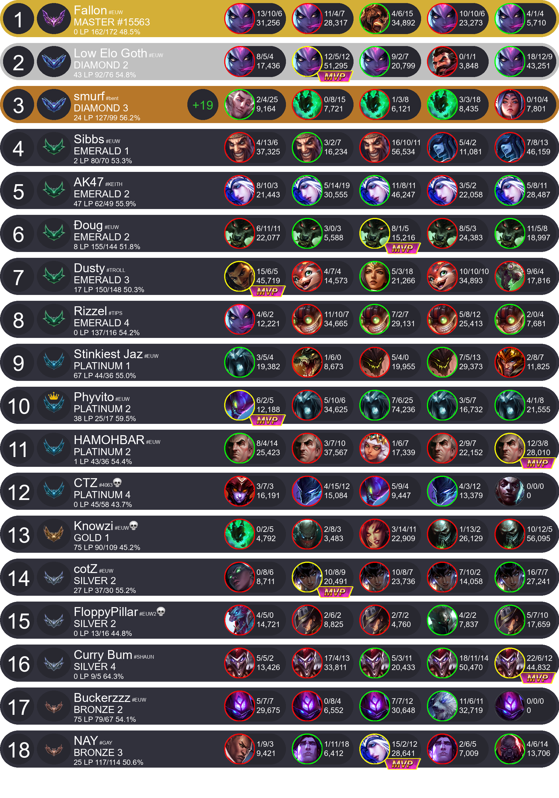
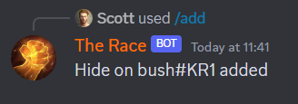
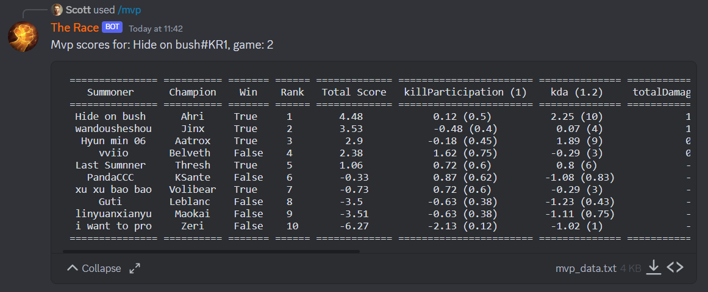
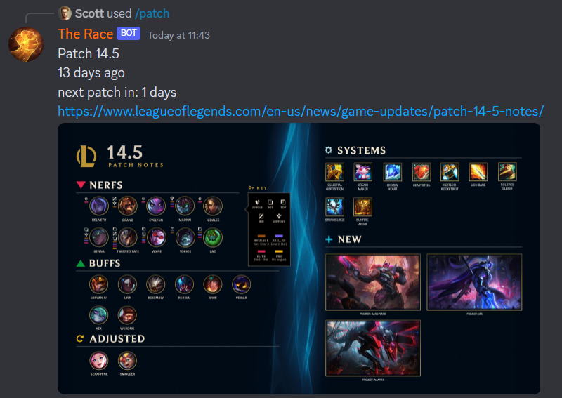
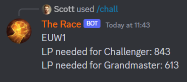
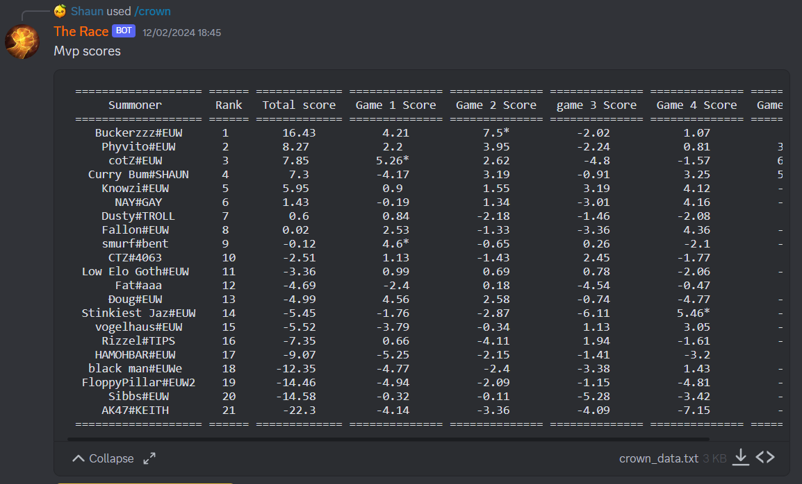

    A League of Legends leaderboard/live game tracker+ discord bot

## Features
-   Live game tracker
    -   Instant updates
    -   LP tracker
    -   Daily LP tracker
    -   5 Recent games with KDA and damage stats
    -   Win/loss streak
    -   Leaderboard position tracker
    -   Daily leaderboard position tracker
-   MVP
    -   Crown holder
    -   MVP banner for each game
    -   MVP breakdown for games
    -   Customizable MVP algorithm using z-score normalisation
-   Patch notes
    -   Tracks and posts official patch note releases
-   Other
    -   Add/Remove summoners from any region
    -   Display needed LP for grandmaster & challenger
    -   Crown holder leaderboard
    -   If the summoner is master+, displays the server rank
    -   Supports new champions and patch releases 
## Screenshots

    </img>
    </img>
    </img>
    </img>
    </img>
    </img>
    </img>
    </img>

## Install

### Prerequisites
-   [Python](https://www.python.org/downloads/release/python-3102/)
-   Preferably a system to run it 24/7 (Rasberry pi)

### Setup

## Contributing

View the [contributing guidelines](CONTRIBUTING.md) for more information on how you can help out.

## License

Empyrean is licensed under the <a href="https://creativecommons.org/licenses/by-nc-sa/4.0/deed.en">CC BY-NC-SA 4.0 License</a>.

## Errors?

-   Make an [issue](https://github.com/ScottFal/The-Race/issues)
-   Message on Discord: sc_0001

